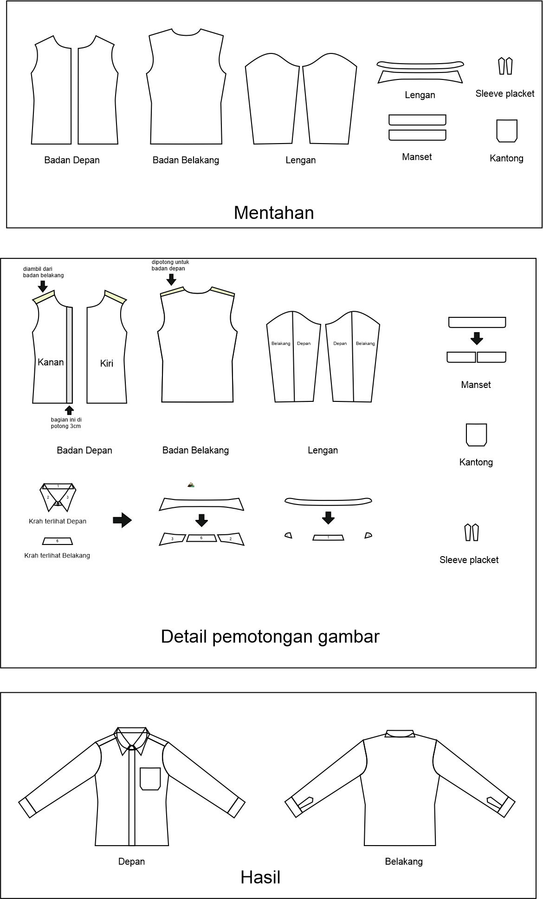
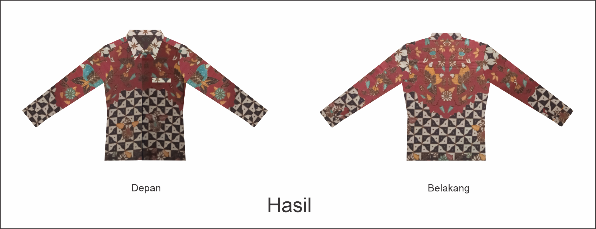
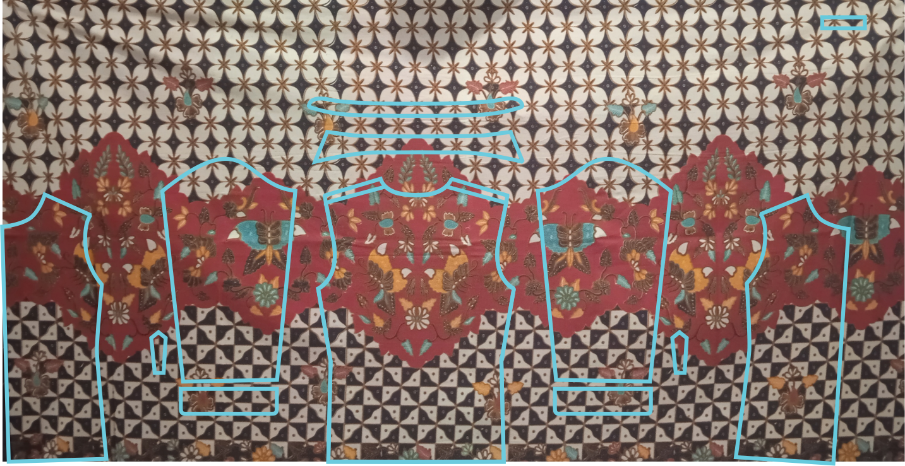

# POLA KEMEJA BATIK 

Aplikasi Pola kemeja batik ini masih berupa front end dengan menggunakan flutter.
Akan ada penambahan fitur :
- menyimpan gambar.
- zoom in / zoom out pada gambar.
- slide pada hasil pemrosesan.

Sementara itu untuk back end akan menggunakan openCV(template matching) python yang dihubungkan menggunakan heroku. 

 Untuk back end nya sendiri.pencarian nya satu persatu perbagian.

jadi pertama tentukan bagian mana yang akan diambil untuk dicari yang memiliki gambar yang sama.

1. misal untuk badan depan kita ambil 3 cm(ukuran asli). lalu cari gambar yang sama. biasanya untuk badan kanan mengambil bagian sisi kiri kain ,dan sebaliknya untuk badan kanan. Setelah itu menemukan motif yang sama lalu ambil gambar sesuai dengan pola belakang

2. Untuk badan belakang ambil bagian tengah kain. biasanya memiliki motif yang berhadapan . Jadi pemrosesannya ambil seukuran badan lalu potong ambil 2 bagian/ misal ambil sisi kiri, lalu balik gambarnya. Lalu cari apakah sama , Jika sama lalu ambil gambar sesuai dengan pola badan belakang

3. Untuk lengan biasanya diambil diantara badan depan dan belakang . Tinggal potong seukuran lengan lalu cari motif yang sama.

4. Kalau untuk kerah dan daun kerah diambil pada bagian atas badan belakang. karena sudah memiliki motif yang berhadapan.

5 Untuk manset biasanya berada di bawah lengan 

6 Untuk sleeve placket bisa bebas yang penting memiliki motif sama

* keterangan : setelah menemukan motif yang sama dan menentukan bagian pola, maka bagian yang sudah ketemu(diambil) maka diblok warna agar tidak bisa terdeteksi atau terpilih lagi pada bagian kemeja yang lain.

## Keterangan sourcode diatas

folder build tidak saya tambahkan karena memiliki ukuran yang cukup besar, hanya folder build pada umumnya, cuma ada penambahan pakcage yang dapat dilihat di pubspec.yaml

## Video penggunaan aplikasi

 
 https://user-images.githubusercontent.com/45233368/155824022-ea8df08f-02d8-4231-b24b-4e46fb94269b.mp4
  

 

Aplikasi di atas masih belum selesai. 

 Keterangan video:
 - Tidak langsung muncul pop up informasi dan bantuan , user harus menekan tombol yang dibawah
 - Belum menampilkan hasil pemrosesan

 

## Rancangan penentuan bagian baju

  
  <h5 align ="center">Rancangan</h5>

## Hasil yang diharapkan

  
  <h5 align ="center">Desain</h5>
   
  
  <h5 align ="center">Pola</h5>

Bagian pola tubuh depan seharusnya tidak miring seperti itu,karena contoh gambar yang saya ambil tidak lurus. saya mencoba untuk mencari motifnya.

Dan untuk kantongnya opsional bisa memakai yang kotak seperti di rancangan atau memakai kantong paspol seperti gambar di desain hasil jadi. 
Dengan ketentuan kantong : jika dalam pencarian kantong tidak memiliki motif maka menggungakan paspol (bebas tidak harus bermotif)

 
 

## Permasalahannya

1. Untuk ukuran kemeja, sebaiknya bagaimana ya pak?. Menggunakan ukuran badan asli dari pengguna, atau  di beri ukuran misal (S, M, L, XL). Kalau menggunakan ukuran badan asli , harus menggambar dulu pola nya sesuai inputan user. Sedangkan untuk ukuran (S, M, L, XL) kita bisa menggunakan template pola kemeja yang sudah disiapkan.
 

 

2. Untuk proses pencarian gambarnya sendiri menggunakan template matching. Tapi untuk sekarang untuk pencocokan gambar yang sama masih belum menemukan posisi yang tepat

3.  Batik tulis yang asli terkadang tidak memiliki gambar yang simetris jadi proses pencarian gambar agak susah terdeteksi
 

